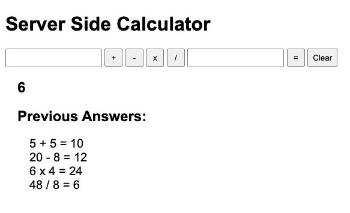

# Weekend Challenge: Server Side Calculator

## Description
This application is a server-side, four operation calculator. This project utilizes Node.js, Express, jQuery, HTML, and CSS. This project implements server and client side functionality to complete a mathematical calculation, display the solution, and to store historical data while the server is running.

- Users can input two numbers and operator into interface.
- Calculator returns solution and displays a historical record of previous solutions.
- All logic and operations are done on Express server.
- Historical data of previous inputs and solutions are stored on server.

## Screen Shot

## Project Requirements
[x] Create a user interface where the user can input two values with two input elements and select the type of mathematical operation.

[x] When the equal button is clicked, capture this input, bundle it up in an object and send this object to the server via a POST.

[x] 'C' button that will clear the user input fields.

[x] Build out the server-side logic to compute the numbers as appropriate.

[x] The server should be able to handle Addition, Subtraction, Multiplication, and Division. Logic for calculator must be implemented on the server.

[x] Once the calculation is complete, send back the OK. You should do a GET request after the POST to get the actual calculation.

[x] Keep a historical record of all math operations and solutions on the server. Display a list of all previous calculations on the page when it loads using a GET request. Update the list when a new calculation is made.

[x] History should exist even after refreshing the page.